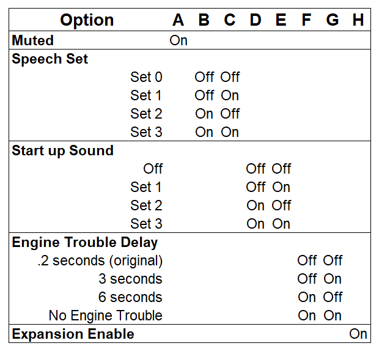

# TRS2-Speech-Board
This is a mod for adding speech to TRS2 Arcade PCBs. These do not natively support speech like the TRS1 PCB sets which utilized a M58817 speech IC. The TRS2 speech board utilizes a Raspberry Pi Pico 2 equipped with CircuitPython to play speech samples from one of four pre-programmed speech sets.

## Installation Instructions

## Controls and Adjustments
There are two buttons, volume adjustment, and a set of 8 dip switches. 

The "Test" button brings the speech module into a self test mode in which it plays all the speech clips in the set. You can exit the speech test early by pressing the test button again. If hooked up to a python terminal, it also print out information about the state of the dip switches and databus. If the expansion dip switch is enabled it will enter in an expansion lamp test mode. To exit that test mode, press the test button again.

The "Reset" button does exactly as it says. When pressed, it resets the module to the start of the program. The volume can be adjusted by turning the knob labeled "voice volume". 

The dip switch options can be used to change how certain aspects of the speech board behaves. *For stock operation: all dip switch settings should be set to "off"*. The muted option puts the board in a state in which it will not play any audio. The speech set setting changes with set of samples plays. Set 0 is the original set. Start up sound plays a clip when the module is activated on bootup. Engine Trouble Delay is just how much time passes between each time the "Engine Trouble" voice line is played. If desired the "Engine Trouble" line can be disabled. The last option is the Expansion enable. Because there were extra pins available, code was written to support a lamp display that is based on game conditions. Turning it on 



## Theory of Operation

## Speech Board Hardware

### Bill of Materials
|  **Reference** |     **Value**    |          **Part Number**          |
|:---------------|:-----------------|:----------------------------------|
| C1,C3          | 100uF            | 25YXM100MEFR6.3X11                |
| C2, C4-C9, C12 | 100nF            | FG28X7R1H104KNT00                 |
| C10            | 100nF (Poly)     | R82DC3100DQ50J                    |
| C11            | 10nF (Poly)      | R82EC2100Z350K                    |
| P1             | 12 pin connector | LHA-12-TRB                        |
| P2             | 10 pin connector | LHA-10-TRB                        |
| R1,R2          | 330              | Generic 1/4W 6.3mm Resistor       |
| R3             | 50k              | Generic 1/4W 6.3mm Resistor       |
| R4-R6          | 100k             | Generic 1/4W 6.3mm Resistor       |
| R7             | 6.8k             | Generic 1/4W 6.3mm Resistor       |
| R8             | 3.9k             | Generic 1/4W 6.3mm Resistor       |
| R9             | 47               | Generic 1/4W 6.3mm Resistor       |
| RN1            | 4.7k x 10        | 4611X-101-472LF                   |
| RN2            | 100k x 4         | 4605X-101-104LF                   |
| SW1            | DIPSW x 8        | Generic 8 switch dip switch       |
| SW2, SW3       | Push Button      | Generic Tactile Push Button       |
| U1             | Pico 2           | Raspberry Pi Pico 2               |
| U2             | 74HCT374         | SN74HCT374N or 74LS374N           |
| U3             | TL032            | TL032CP                           |
| U4,U5          | TXS0108          | TXS0108EPW                        |
| VR1            | 1k               | Pot:PT10MV10-102A2020-S Knob:5116 |
### Schematics


## Speech Board Tester Hardware
This is just a Jamma adapter that was used to provide an easy hookup to a test bench for power and the speaker. It was used for testing the speech board when the algorithm was still being developed. It serves no real purpose now that the code has been developed but is being provided anyway. 


## Sound Board ROM Patches
Two ways have been provided for patching the original TRS2 sound ROM: A hardware patch and a software patch. The original TRS2 sound ROM would not communicate correctly with the new speech board. As such a patch would have been required to write to the speech module. 

### Hardware Patch
The hardware patch is a simple board in which the original sound rom is plugged into a daughterboard which is then plugged into the original ROM socket. It works by switching which chip outputs code at certain addresses. Essentially making it a hardware patch.

### Software Patch
In case that one doesn't want to use the daughterboard, a new single rail 2716 EPROM can be burned using a patched ROM file that replaces the original at 3I.

1. Dump the sound ROM located at 3I 
2. Patch the sound ROM with the trs2s3i.ips patch file using LunarIps
3. Burn the new ROM onto a 2716 EPROM
4. Replace the sound ROM located at 3I with the patched ROM

### Patch Source Code 
This code was written in 8035 assembly. The memory address 0x20 (unused in the game) now stores the speech bus state.

```Asm
Address Instruction Opcode
--------------------------------
104     CALL $2A0   54 A0

2A0     ANL a,#$0F  53 0F
2A2     MOV r0,a    A8
2A3     IN a,p2     0A
2A4     ANL a,#$20  53 20
2A6     RR a        77
2A7     ORL a,r0    48
2A8     OUTL bus,a  02
2A9     ANL a,#$20  53 0F
2AB     MOV r0,#20  B8 20
2AD     RET         83

2B0     MOV r7,#$60 BF 60
2B2     MOVX a,@r0  80
2B3     CPL a       37
2B4     ORL a,#$10  43 10
2B6     OUTL bus,a  02
2B7     RET         83

614     CALL $2B0   54 B0
```

## Special Thanks
A very special thanks goes out to Markus Karrer Ostermayer of the awesome site [The Radar Scope Pages](https://www.ostermayer.ch/index.html). He had performed the initial research that I based this project off of as well as providing samples of the original speech. Without his contributions, this project would have not been possible.